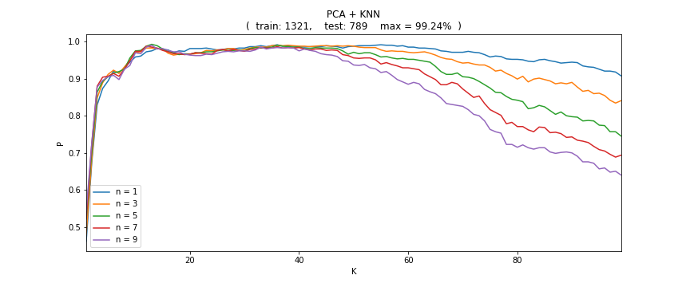
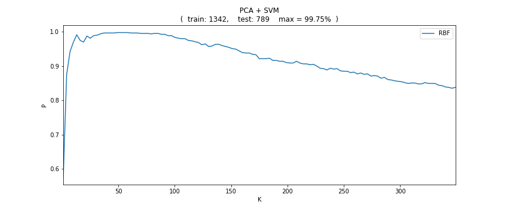

# *Machine-Learning*
## *机器学习笔记*

-----
> 运行环境: python3.6 常用第三方库: numpy, pandas, matplotlib, sicpy, sklearn, skiamge, PIL, TensorFlow 使用工具: Sublime Text3, Pycharm, Jupyter Lab,Spyder, Anaconda3

## 机器学习(分类)基本步骤:
1. 准备数据
2. 特征提取
3. 分类器分类

## 特征提取方法:
* PCA(主成分分析, Principal_Component_Analysis)
* LBP(局部二值模式, Local_Binary_Patterns)
* HOG(方向梯度直方图, Histogram_of_Oriented_Gradient)
* ...

## 分类器模型:
* KNN(K最近邻, K-NearestNeighbor)
* SVM(支持向量机, Support_Vector_Machine)
* ...
----
## *scineo库说明:*
> 调用库: numpy, matplotlib, sklearn, time 

scineo库将机器学习中常用的功能封装成函数,测试和实验时直接调用函数,不用重复编写.

### 已实现功能:
* PCA
* KNN
* SVM

----

----

## 纺织品瑕疵检测实验

> 数据集介绍

  

* 样本共计2131份
* 样本分为四类别
* 原始数据为128*128大小bmp格式Image文件
* 数据存储为npy格式文件

  
 
  
> 实验方法: PCA + KNN

  
 
进行PCA主成分提取出K个特征维度,分别使用不同n值的KNN分类器进行分类

实验的训练样本个数为1321,测试样本个数为789

k的取值为(1,100), n的取值为(1,3,5,7,9)

k取13, n取5时有最高的识别率99.24%

* 实验结论:

1. 识别率p会随着k的增加先升高后下降
2. k达到一定值后,p随着n的变大而降低

 

>实验方法: PCA + SVM

  

进行PCA主成分提取出K个特征维度,分别使用不同核函数为的SVM分类器进行分类

实验的训练样本个数为1321,测试样本个数为789

k的取值为(1,100), n的取值为(1,3,5,7,9)

k取49, 52, 55, 58时均有最高的识别率99.75%

* 实验结论:

1. 识别率p会随着k的增加先升高后下降

 

> 实验说明

----

$$Laplace Operator: ∆f = \frac{1}{r^2} \frac{𝝏}{𝝏r}(r^2 \frac{𝝏f}{𝝏r}+\frac{1}{{r^2}{sin𝝋}}\frac{𝝏}{𝝏𝝋}(sin\frac{𝝏}{𝝏𝝋}))+\frac{1}{{r^2}{sin^2}𝝋}\frac{{𝝏^2}f}{𝝏{𝜽^2}}   $$

----
